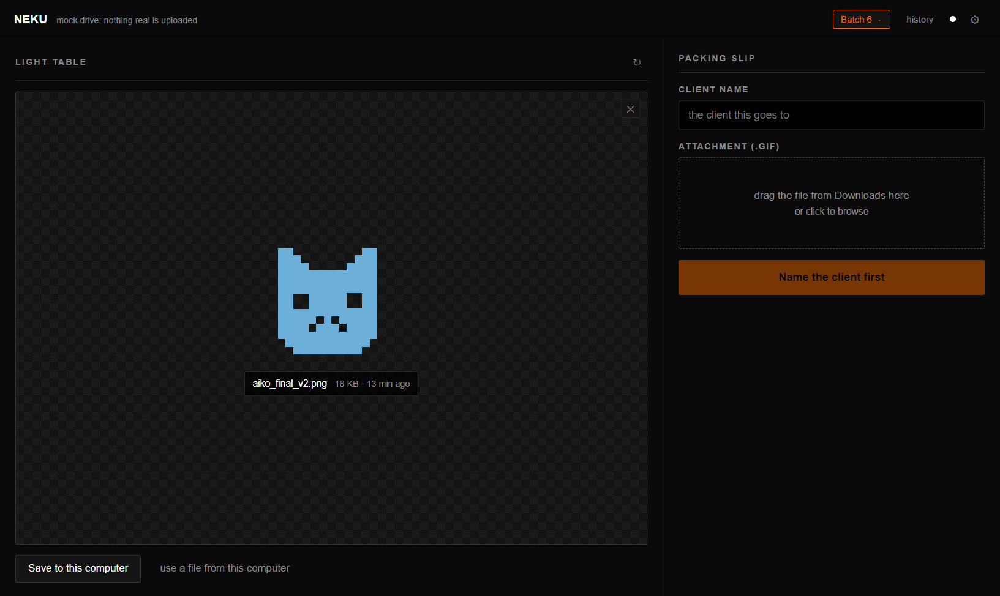
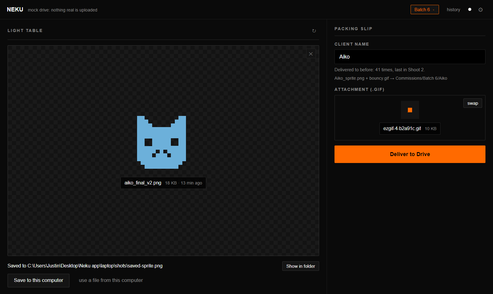
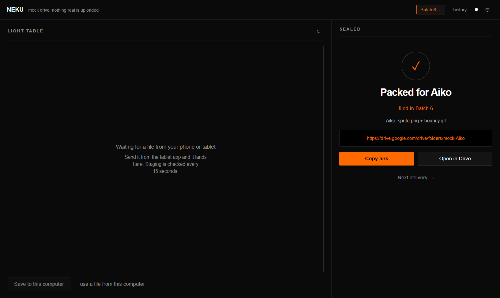
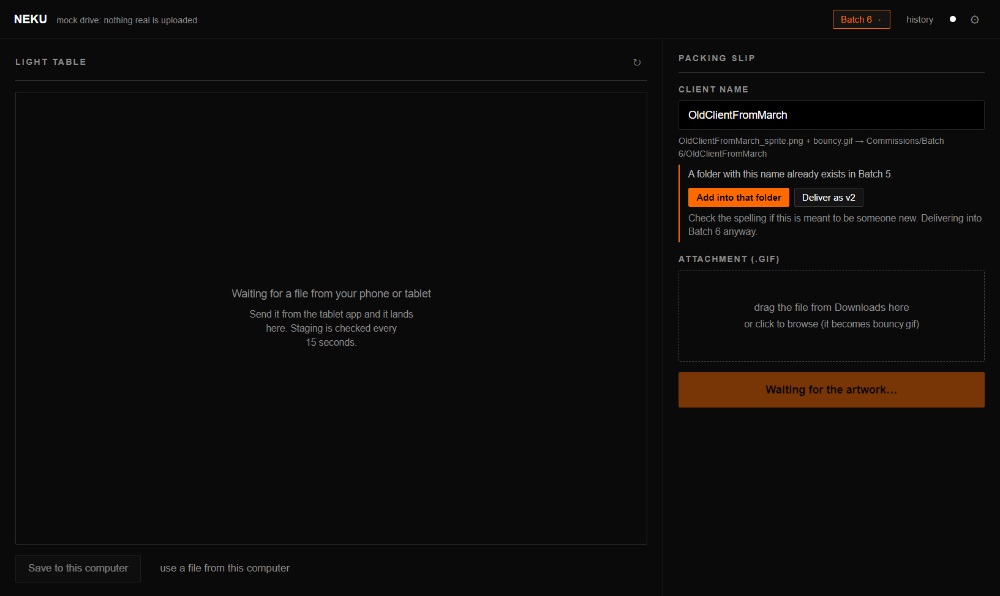
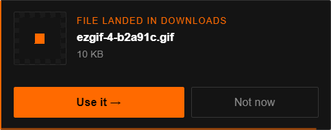
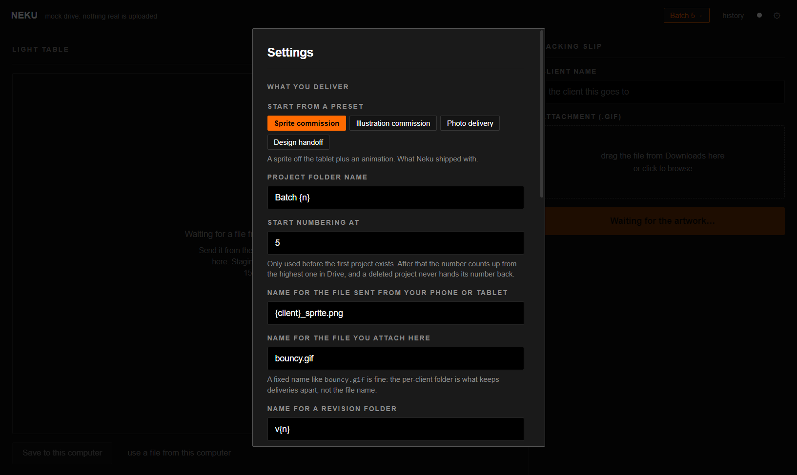
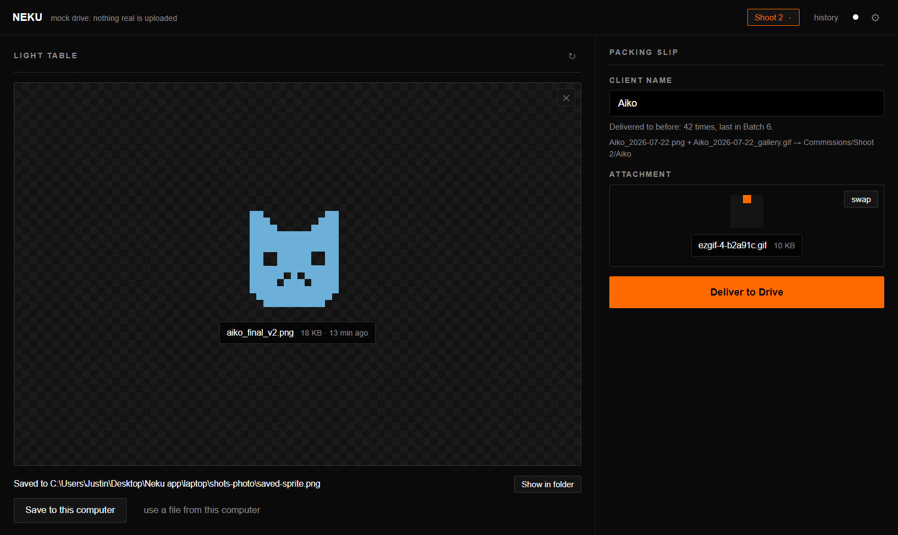
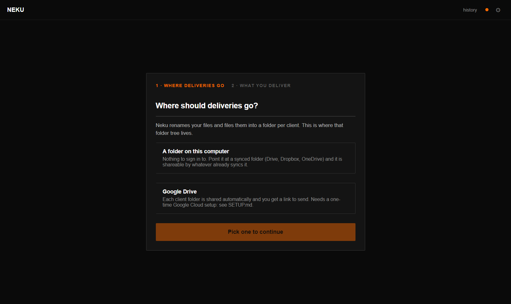

# Neku

**A two-surface delivery tool for freelancers.** Send a file from your phone or tablet,
pair it with another one on the desktop, and both land renamed in a per-client folder that
is shared back as a single link.



Neku was built for one working sprite artist with a real, specific pipeline, then
generalised without migrating him off it. His setup is still the default, and the
`Batch 5` folders in these screenshots are his naming, not the app's.

---

## Try it in one minute

No account, no credentials, nothing to configure:

```bash
cd laptop
npm install
npm run mock      # the whole app against a fake Drive; nothing is uploaded
```

To watch it drive itself through the entire flow and screenshot every step:

```bash
npm run shots     # writes to shots/, including a transcript in autopilot.log
```

Or run it for real against a plain folder on your computer (also no account):
`npm run dev`, then pick **A folder on this computer** on the first screen.

---

## The problem

A commission artist draws on a tablet, animates in a browser tool, and sends the finished
pair to a client. Before Neku, every delivery meant: AirDrop or self-DM the drawing to the
laptop, find it in Downloads, rename it by hand to the client's name, open the Drive web
UI, make a folder, drag two files in, set sharing, copy the link, paste it into a DM. Once
per client, several times a week, each step silently able to go wrong in a way the client
sees.

Neku is that sequence, minus the parts a person should not have to hold in their head.

## The flow

1. **Send from the tablet.** A one-screen PWA: pick the file, preview it, Send. It lands in
   a Drive staging folder.
2. **It appears on the light table.** The desktop app polls staging and shows it. If you are
   looking at another window, a small always-on-top card tells you it arrived, with a real
   preview so you can tell the right export from the wrong one.
3. **Type the client's name.** Neku shows exactly what will be created before anything
   uploads, and warns if that client already exists.
4. **Drop the second file.** Or let Neku offer it: it watches your Downloads folder and
   catches the file the moment it finishes downloading.
5. **Deliver.** Folders, renames, upload, sharing, link. Five steps that stamp themselves,
   then the link is on your clipboard.




---

## Design decisions worth explaining

These are the parts that took thought. Most of them are decisions *not* to do the obvious
thing.

### Drive itself is the sync layer. There is no backend.

Two surfaces need to agree on a file, and there is no server. Both apps hold their own
OAuth token and talk to the Drive API directly, so the file itself carries the handshake:
the desktop stamps `appProperties.nekuSeen` on a staged file as it appears on the light
table, and the tablet reads that stamp back off the file it uploaded. That is how the
tablet knows the laptop got it, with nothing in between to host, monitor, or pay for.

### Only the client folder is ever shared

Never the project folder. Sharing one level up would mean any client's link exposes every
other client in that project. This is also why revisions are a subfolder rather than a
sibling.

### A repeat client is a revision, and the app refuses to guess

An existing client folder means one of two things. For the artist Neku was built for it is
a typo, because he has no repeat clients. For everyone else it is v2. Neku shows what it
found and offers both, with "add into that folder" as the default because that is what it
has always done.

Revisions go in a **subfolder** (`v2`, `v3`), never a filename suffix and never a second
client folder. So no filename can collide, and **the link already sent to that client keeps
working** and simply gains the new files.



The revision number is resolved before the upload starts and passed in, not worked out
during it. Otherwise hitting Retry after a partial failure would create a `v3` beside the
`v2` it had already made.

### Preview before upload is a requirement, not a nicety

Nothing is ever sent that you have not seen. The destination is spelled out in full before
the button is live, and both files are shown as images where they can be.

### The arrival notice is its own window

Not a Windows notification, not an in-app banner. Both cases where Neku wants attention are
cases where you are looking at something *else*, so it has to be a real always-on-top
window, and it uses `showInactive()` so it never steals focus.

The two arrivals are deliberately asymmetric. The card is suppressed when Neku is focused
for a file off the tablet, because it lands on the light table right in front of you and a
card repeating that is noise. It is **not** suppressed for a finished download, because a
downloaded file appears nowhere in Neku by itself, so it can never be redundant.



### Deleting is always recoverable

The X on the light table trashes the Drive file rather than hard-deleting it, and asks
first. In local-folder mode it moves to a `.neku-trash` folder. The wrong file and the
right file are one click apart, so the cost of a mistake has to be a trip to the trash, not
the artwork.

### Retry after a partial failure is safe

Uploads fail halfway. The delivery pipeline re-checks what already happened instead of
repeating it: a folder that exists is reused, a file already moved is left alone, and the
typed name and attached file stay put.

### Every name comes from a template

Nothing in the app writes a folder or file name from a constant. Five settings drive all of
it, with tokens `{client} {project} {n} {date} {name} {ext}`. Presets are just prefilled
sets of those strings, so supporting a new trade is a data change, not a code change.

An unknown token is left visible rather than blanked, so a typo shows up in the preview as
literal `{cleint}` instead of silently producing `_sprite.png`.



Same app, same code path, a photographer's naming:



---

## Architecture

```
tablet/     a static PWA, no build step. Deployed by copying to any static host.
            (a submodule: github.com/Just1nboy/neku-tablet)
laptop/     Electron + React via electron-vite
  src/main/
    naming.mjs          every name in the app, as templates + presets
    drive.js            Google Drive backend
    storage-local.js    plain-folder backend (no account needed)
    drive-mock.js       in-memory backend for mock runs
    gif-watch.js        Downloads watcher, waits for files to stop growing
    notice.js           the always-on-top arrival card
    autopilot.js        drives the whole UI and screenshots it
  src/renderer/src/     the workbench UI
```

Three storage backends export identical shapes, so `ops()` picks one and nothing above it
knows which is live. Adding a backend does not touch the UI.

```bash
npm run dev            # the real app
npm run mock           # fake Drive, no credentials
npm test               # naming engine + local-folder backend
npm run shots          # self-driving run, screenshots to shots/
npm run shots:photo    # the same run under a different trade's naming
npm run shots:wizard   # first-run wizard, into a real local delivery
npm run dist           # portable .exe
```

## How this is tested

An Electron app that talks to Google Drive is awkward to test honestly, so the verification
is split by what can be checked for real:

- **`npm test`** covers the naming engine and the local-folder backend. `storage-local.js`
  imports no Electron, so those tests drive it against a real temp directory and assert on
  files that genuinely exist, including that a revision leaves v1 untouched and that a
  retry after a partial failure does not throw.
- **`npm run shots`** is a self-driving run against the mock backend. It walks the entire
  flow, asserts against the real DOM at each step, and fails loudly with a transcript. It
  covers the parts that only exist as UI: the corner notice, the discard confirmation, the
  cross-project typo warning, switching projects.
- **`npm run shots:photo`** runs that same script under a different trade's naming, which
  is what proves the pipeline is not tied to one set of names. Every expected folder name is
  derived from the naming the app booted with.
- **`npm run shots:wizard`** stubs the native folder picker, walks the first-run wizard, and
  then checks that a project folder actually appeared on disk.

The screenshots in this README are all generated by those runs.

---

## Setup

**Local folder mode** needs nothing. Run it and pick a folder.



**Google Drive mode** needs a one-time Google Cloud setup, covered in
[SETUP.md](SETUP.md): one Cloud project, a Desktop OAuth client for the laptop and a Web
one for the tablet. [HANDOFF.md](HANDOFF.md) is the other side of that, written for the
person receiving a prepared build: two installs, no terminal, no configuration.

Scope is `drive.file` on purpose, which means Neku only ever sees files it created itself.
It keeps the "unverified app" friction near zero and means installing it grants no access
to the rest of your Drive.

## Known limitations

- Local-folder mode cannot share, because a folder on your computer has no link. Point it
  at a synced folder and whatever syncs it handles sharing.
- The tablet handshake is Drive-only for the same reason: nothing else polls a local folder.
- `drive.file` scope means folders created by hand before Neku are invisible to it.
- Tablet sign-in tokens last about an hour and are re-acquired silently, which can briefly
  flash a Google popup.
- Sending the client message is still manual, on purpose.
